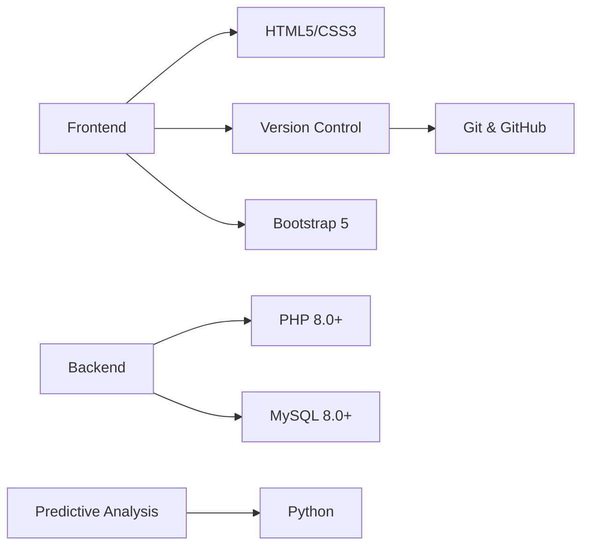

<div align="center">

# Smart Inventory

### Your Modern Inventory Management Solution

</div>

<div align="center">


[](https://www.php.net/)
[](https://www.mysql.com/)

</div>

## 🎯 Overview

Smart Inventory is a powerful, modern inventory management solution that revolutionizes how businesses track inventory. It provides functionalities for generating sales, inventory, supplier, predictive analysis, and financial reports, empowering managers and administrators to make informed decisions. Built with scalability and efficiency in mind.

## ✨ Key Features

<details>
<summary>🔐 Security & Authentication</summary>

- Role-based access control (Admin, Manager, etc.)
- Secure password hashing
- Session management for authenticated user sessions
- Unauthorized access redirection
</details>

<details>
<summary>📦 Inventory Control</summary>

- Real-time stock tracking
- Supplier and purchase order integration
- Stock movement history and reporting
- Warehouse and location-based inventory tracking
- Inventory valuation and cost management
</details>

<details>
<summary>💹 Sales Management</summary>

- Sales transaction records
- Sales report generation with custom date ranges
- Integration with inventory for stock deduction
</details>

<details>
<summary>📊 Reports & Analytics</summary>

- Generate detailed reports for Sales, Inventory, Suppliers, and Financial data
- Date-range filtering for customized report generation
- Export reports in text format for easy offline access
- Predictive analysis reports based on historical data
</details>

<details>
<summary>📑 User Interface</summary>

- Intuitive dashboard with role-specific views
- Generate and view reports directly from the UI
- Print reports with custom formatting
- Responsive design for multiple device compatibility
</details>

## 🛠️ Tech Stack



## 🚀 Quick Start

```bash
# Clone repository
git clone https://github.com/GovardhaneNitin/smart-inventory.git

# Navigate to project
cd smart-inventory

# Database Setup Guide

## Prerequisites
- XAMPP or similar local server environment with MySQL
- phpMyAdmin access

## Setup Steps

### 1. Access phpMyAdmin
- Navigate to http://localhost/phpmyadmin in your web browser
- Login if required

### 2. Create Database
- Click "New" in the left sidebar
- Enter database name: `smart_inventory_db`
- Click "Create"

### 3. Import Database Structure
- Select `smart_inventory_db` from sidebar
- Click "Import" tab
- Browse and select `Database/smart_inventory.sql`
- Click "Go" to execute import

## Verification
- The database should now be populated with necessary tables
- You can verify by checking the structure in phpMyAdmin
```

## 👥 Project Members

<div align="center">

### 👨‍💻 **Team Lead**

**Nitin Govardhane**  
[](mailto:nitingovardhane000@gmail.com)

### 👩‍💻 **Team Members**

**Jitesh Borse**  
[](mailto:khushborse92@gmail.com)

**Vedanti Lakade**  
[](mailto:lakadevedanti@gmail.com)

</div>

---

## 📄 License

This project is licensed - see [LICENSE](LICENSE) for details.

## 🌐 Connect with Me

- LinkedIn: [LinkedIn Profile](https://www.linkedin.com/in/nitingovardhane/)
- Twitter: [Twitter Profile](https://x.com/blackhawk_vk18)

---

<div align="center">
Made with ❤️ by Smart Inventory Group
</div>
